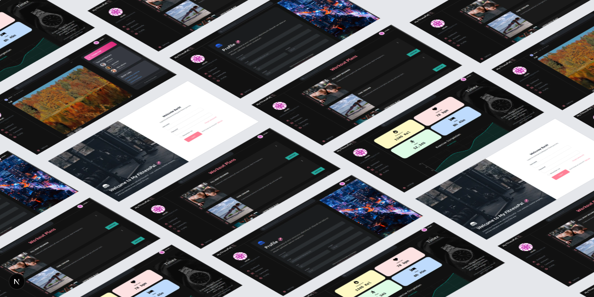

<p align="center">
  
</p>

# MyFitness Pal 🏋️‍♂️

A full-stack fitness tracking web app built with **React** and **Django REST Framework**, designed to help users log, manage, and visualize their fitness journey. Includes secure **JWT authentication**, a clean modern UI, and modular architecture for easy development and scaling.

---

## 🚀 Features

-  **JWT Authentication** (Login, Register, Token Refresh)
-  **Modern UI** using:
  - [Shadcn/UI](https://ui.shadcn.com/)
  - [Material UI](https://mui.com/)
-  Track fitness data like workouts, calories, and progress
-  Responsive and accessible design
-  Modular codebase with separate frontend and backend

---

## 🔧 Tech Stack

### 🖥️ Frontend
- [React](https://reactjs.org/) (Vite)
- [Shadcn/UI](https://ui.shadcn.com/)
- [Material UI](https://mui.com/)
- React Router

### 🔙 Backend
- [Django](https://www.djangoproject.com/)
- [Django REST Framework](https://www.django-rest-framework.org/)
- [Djoser](https://djoser.readthedocs.io/en/latest/) for JWT-based authentication

### 🔐 Authentication
- JWT (JSON Web Tokens)
- Token-based login, registration, and refresh flow

### 🛠️ Tooling & Others
- Axios (API requests)
- Postgres or SQLite (can be configured)
- Environment variable-based config


## 🛠️ Getting Started

Follow these steps to run the project locally.

---

### 🔁 Clone the Repository

```
git clone https://github.com/SSKnT/my-fitnesspal.git
cd my-fitnesspal
````

---

### 🧠 Backend Setup (Django)

```bash
cd djangoBackend
python -m venv env
source env/bin/activate  # For Windows: env\Scripts\activate
pip install -r requirements.txt
python manage.py migrate
python manage.py runserver
```

This will start the backend server at `http://localhost:8000`.

---

### 💻 Frontend Setup (React)

In a new terminal tab or window:

```bash
cd ../react-frontend
npm install
npm run dev
```

This will start the React app at `http://localhost:5173`.

---

### 🔐 Environment Variables

Make sure to create `.env` files for both the frontend and backend as needed.


---

## 📃 License

This project is licensed under the [MIT License](LICENSE).

---

## 🤝 Contributing

Contributions are welcome!  
Feel free to fork the repository and submit a pull request. For major changes, please open an issue first to discuss your idea.

---

## 📫 Contact

Created by [Sohaib](https://github.com/SSKnT)  
If you have any feedback, suggestions, or want to collaborate, feel free to reach out!


